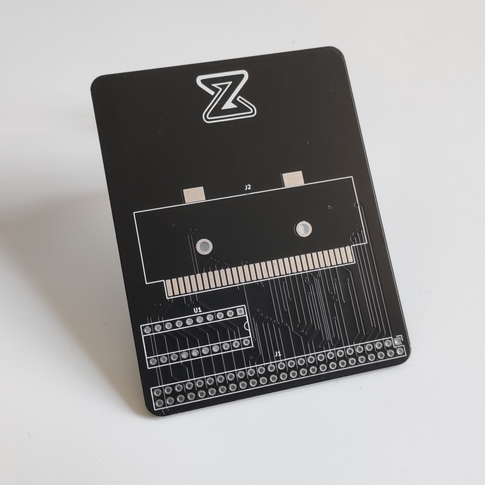

## Gameboy (Color) cartridge adapter for Zeal 8-bit Computer

<center>
    
</center>

### This repository is part of [this Youtube video](https://www.youtube.com/watch?v=MxnD7FFjDEM), check it for more information and explanation about this project.

The goal of this project is to create an adapter for connecting any Gameboy or Gameboy Color cartridge to Zeal 8-bit Computer. This will offer the possibility to backup the ROM or RAM (saved data), restore the saved data or even modify the saved data in place.

This repository includes:

* An example program, written in C, to communicate with the adapter. It will read 4 RAM banks (32KB in total) from the cartridge and send them through UART. This has been tested with MBC1 and MBC5 cartridges.
* The source code to flash to the PLD (GAL16V8)
* A Kicad (v6) project for the schematics and PCB board


**DISCLAIMER: To prevent any data loss, NEVER plug or unplug the cartridges from the adapter when it is connected to a computer/board that is powered on! I am not responsible for any potential damage caused to the Game Boy cartridge when using the adapter. Use it at your own risk.**

### Requirements

To compile this example you will need:

* bash
* git (to clone this repo)
* make
* Zeal 8-bit OS source code. Only the kernel_headers directory is required, check this repository.
z88dk v2.2 (or later). Only its assembler, z80asm, is strictly required. The latest version of z80asm must be used as earlier versions don't have support for MACRO.
To install z88dk, please check out their GitHub project.

### Build

To build the program, define the path to Zeal 8-bit OS, this will let us find the header files used to assemble the example:

```
export ZOS_PATH=/your/path/to/Zeal8bitOS
```

Then simply use the command:

```
cd software
make
```

After compiling, the folder `bin/` in `software/` should contain the binary `dump.bin`. This file can be then loaded to Zeal 8-bit OS through UART thanks to the `load` command.

The binary can also be embedded within the romdisk that will contain both the OS and a read-only file system. For example:

```
cd $ZOS_PATH
export EXTRA_ROMDISK_FILES="/path/to/this/repo/software/bin/dump.bin"
make
```

More info about compiling [Zeal 8-bit OS here](https://github.com/Zeal8bit/Zeal-8-bit-OS#getting-started).

The resulting ROM image can then be provided to an emulator or directly flashed to the computer's ROM that will use it.

## License

Distributed under the Creative Commons Zero v1.0 Universal License. See LICENSE file for more information.

You are free to use it for personal and commercial use, the boilerplate present in each file must not be removed.

The `zeal8bit.com` silkscreen present on the PCB shall be kept.

## Contact

For any suggestion or request, you can contact me at contact [at] zeal8bit [dot] com or on the Discord server https://discord.gg/UzEjwRvBBb